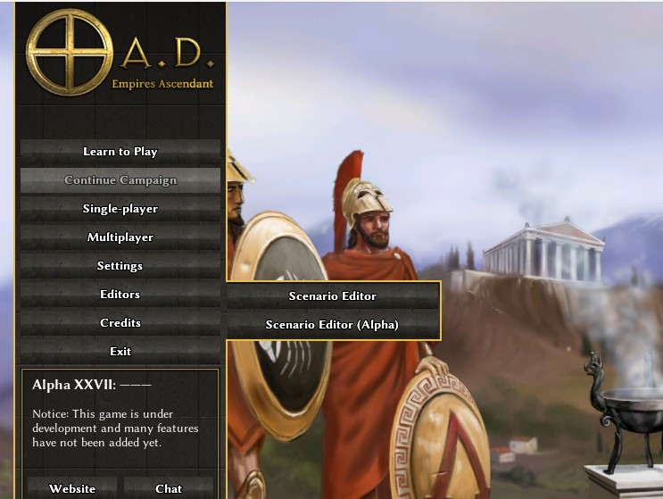
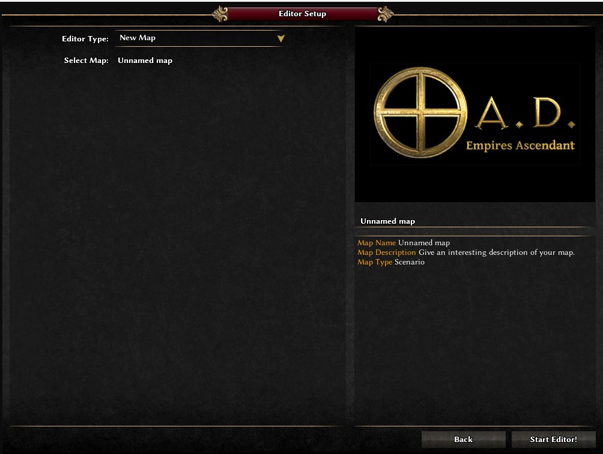
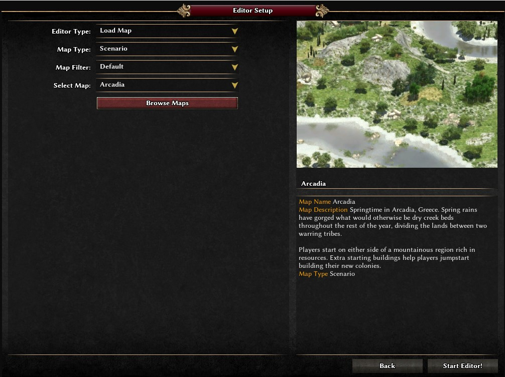
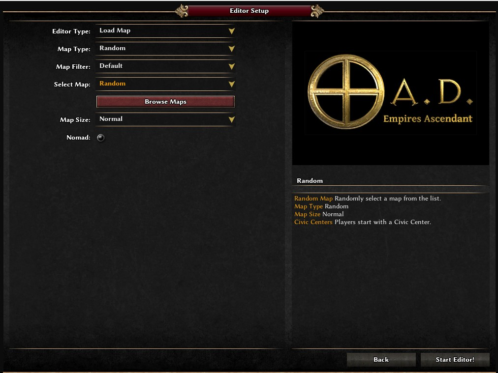
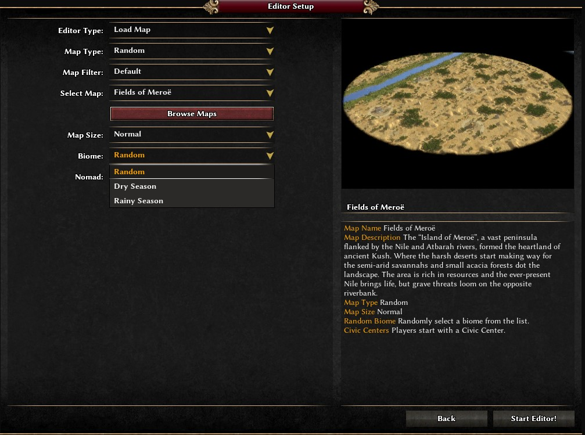
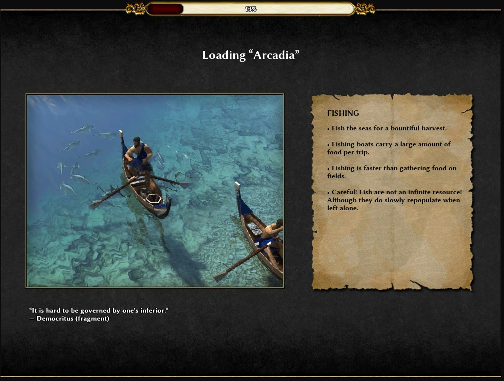
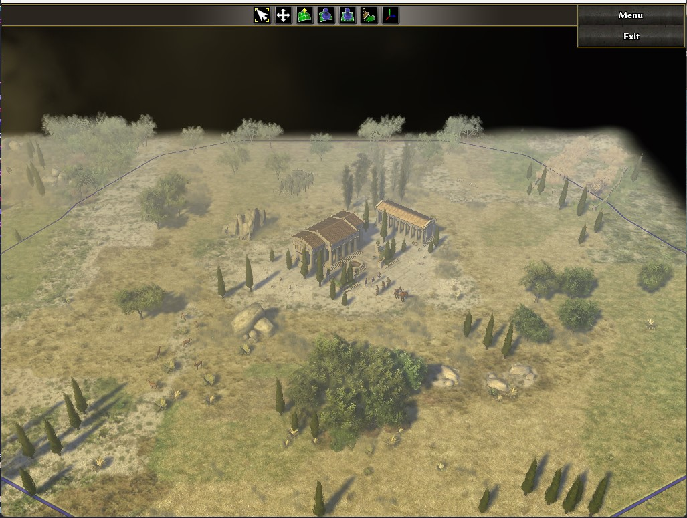

# Ragwis Yuwena Editor (Alpha Version) for 0.A.D
## Overview
There are a iniciative to enabled an editor in pyrogenesis editor. You can read what is the gial of this iniciative [here](https://trac.wildfiregames.com/wiki/GSOC_Ideas#atlas).

This project use the power of mod to extend 0.A.D, thats mean you can mod the editor mod

**CAUTION:** If tou want to test this editor, please use this patch https://code.wildfiregames.com/D4839 , this patch enable the feature used here

-------

## How to use
If you want to test, you should place this in the mod user folder. [More information here](https://trac.wildfiregames.com/wiki/GameDataPaths)

-------
## Current features
### Start menu

### New Map

### Load Map
- Scenario & Skirmish maps

- Random map

- Random map with biomes

### Loading Editor (currently using default design)

### Editor GUI

Toolbar and menu in plugabble way
